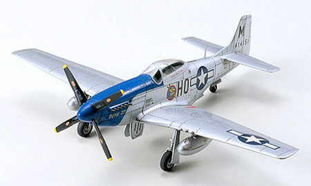

---
tags:
  - Inventory
  - Tamiya
  - Models
---

# 1/72 P-51D MUSTANG

-   __P-51D Mustang__

    ---
    

-   __Paints__

    ---
    AS-6 Olive Drab
    X-8 Lemon yellow
    XF-10 Flat brown
    AS-12 Bare-Metal Silver
    X-10 Gun metal
    XF-16 Flat aluminum
    X-1 Black
    X-11 Chrome silver
    XF-62 Olive drab
    X-4 Blue
    X-18 Semi gloss black
    X-5 Green
    XF-1 Flat black
    X-7 Red
    XF-3 Flat yellow
    XF-5 Flat green
    XF-8 Flat blue

## Paints

| AS Range              | XF Range               | X Range                |
|-----------------------|------------------------|------------------------|
| AS-6 Olive Drab       | XF-1 Flat black        | X-1 Black              |
| AS-12 Bare-Metal Silver | XF-3 Flat yellow      | X-4 Blue               |
|                       | XF-5 Flat green        | X-5 Green              |
|                       | XF-8 Flat blue         | X-7 Red                |
|                       | XF-10 Flat brown       | X-8 Lemon yellow       |
|                       | XF-16 Flat aluminum    | X-10 Gun metal         |
|                       | XF-62 Olive drab       | X-11 Chrome silver     |
|                       |                        | X-18 Semi gloss black  |

